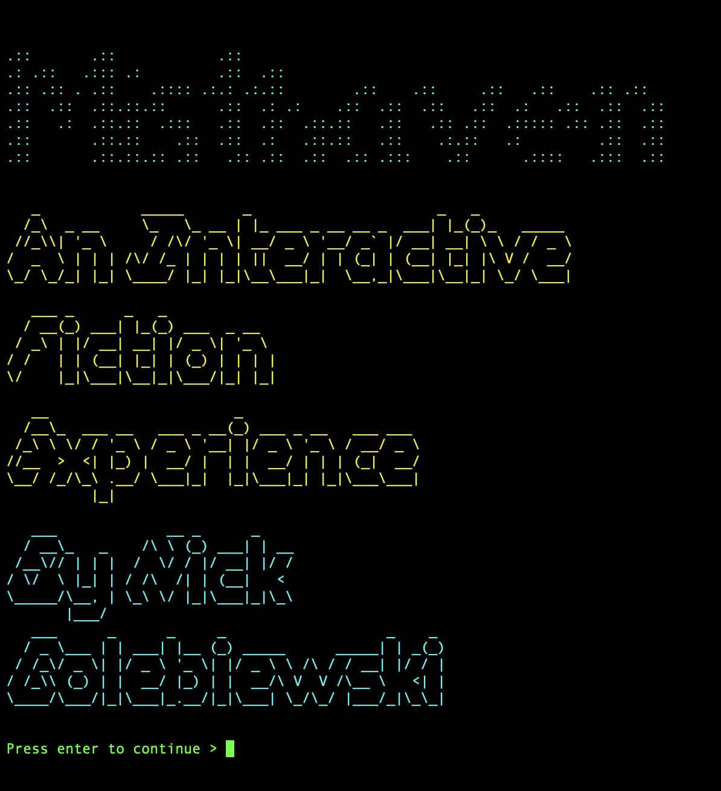

# Command Line Interface Game Engine for 'Choose Your Own Adventure' style interactive fiction.

## Run the project

0. Do you have 
1. Clone github repo: `TKTKTKTK`
2. Create/Activate Virtual Environment:
    1. Create venv directory in the project folder: `python -m venv venv`
    2. Activate
        - Mac/Linux: `$ source venv/bin/activate`
        - Windows Power Shell (IDK, haven't used Windows in over a decade): `PS C:\> venv\Scripts\Activate.ps1`
3. Install required packages via `pip3 install -r requirements.txt`
4. Run program on CLI in Terminal, etc.: `python3 main.py`

## Concept
- Import adventure from a CSV file. Options are in ALL CAPS and link the scenarios together. 
- TKTK
	
## See the Docs

`python3 -m pydoc -p 8080` 

## Note to self:

`pip3 freeze > requirements.txt`

